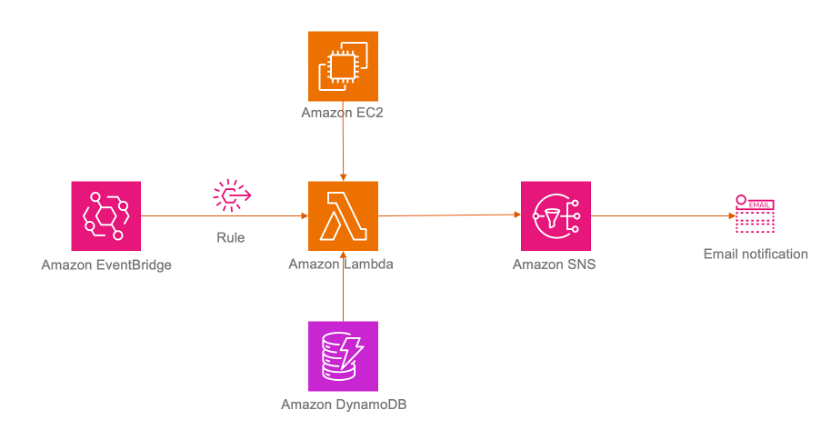

EC2 运行超出预期时长邮件提醒的实现

在日常使用中，我们经常需要创建临时的 EC2 资源。然而，在使用这些资源完成后，及时删除它们非常重要，以避免资源浪费，尤其是对于加速计算和大规格的实例类型。传统的预算或账单警报方式可能无法及时发现和定位这些临时资源。

本文介绍了如何利用亚马逊云科技的 Amazon EventBridge、Amazon DynamoDB、Amazon Lambda 和 Amazon SNS 等服务，实现对特定实例类型的监控，并通过邮件提醒用户。这样一来，用户就能够方便地监控和管理临时资源，有效避免资源的浪费。

方案架构图
运行流程
1.  通过EventBridge 规则定时触发 Lambda 函数进行检测。例如，设置每天上午 09:00 执行检测，规则事件计划时间的 Cron 表达式为 ‘0 9 * * ? *’。
2.  Lambda 函数读取DynamoDB 表中配置的实例类型和计划运行时长。
3.  Lambda 函数根据读取到的信息和正在运行的EC2实例进行比较，获取超过运行时长的实例信息。
4.  Lambda 函数将超时运行的实例信息发布到SNS Topic，通过邮件推送到订阅邮箱。

部署方式
通过cloudformation方式部署 ：
https://console.amazonaws.cn/cloudformation/home#/stacks/new?templateURL=https://yyw-tech-space.s3.amazonaws.com/ec2_runtime_timeout_reminder.yaml.json

创建堆栈
 

输入 堆栈名称、监控的实例类型、预计运行天数、接收通知的邮箱地址等信息
 
点击下一步
 
部署过程中会创建用于Lambda执行的IAM Role。请选择“我确认，Amazon CloudFormation 可能创建IAM资源” 然后点击提交。
 

部署完成后请查看您在部署时配置的邮箱，点击Confirm subscription确认订阅SNS 通知。
 

如需增加或调整监控的实例类型，请在DynamoDB 表中进行修改。

 
对于需要长期运行的实例，请增加为实例增加 Tag name为prod 、Value 为1的Tag，用于将此实例排除在通知清单中。
 

在设置的时间，如果存在运行超出预设时间的实例，您将收到提醒邮件。
 

清理环境
删除cloudformation 堆栈即可。
 

Cloudformation 模版地址：[https://github.com/nwcd-samples/ec2-runtime-reminder](https://github.com/nwcd-samples/ec2-runtime-reminder)
